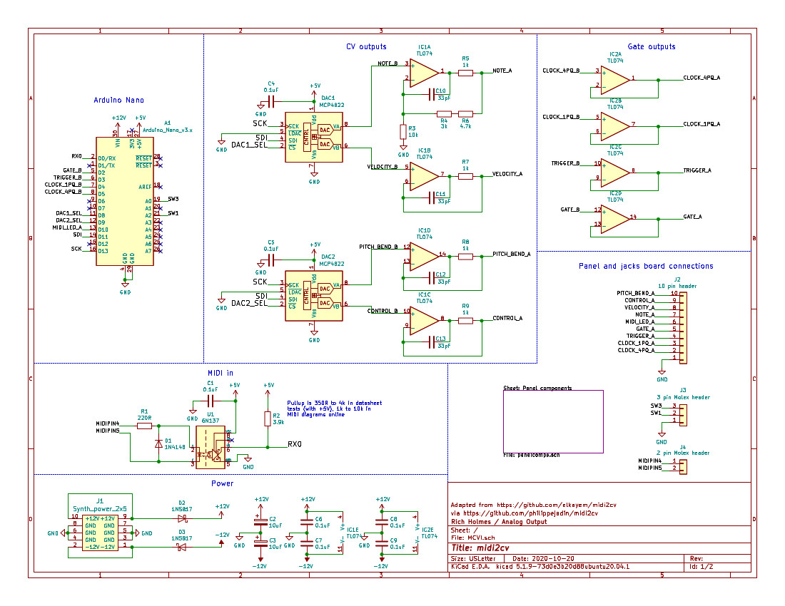
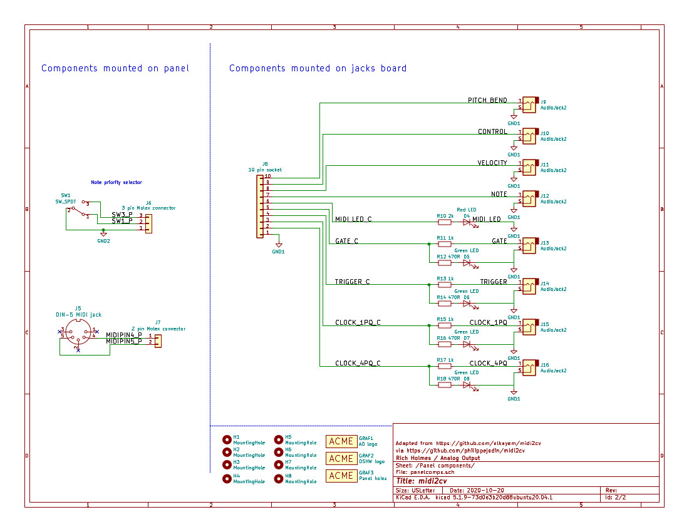

# MCVI

This is a simple MIDI to CV synth module in Kosmo format. It provides pitch and velocity CV, gate, and trigger for Note On events as well as pitch bend and modulation CV for one MIDI channel, and 1- and 4- pulse per quarter note clock outputs.

This project is adapted from [https://github.com/elkayem/midi2cv](https://github.com/elkayem/midi2cv). 

It handles a range of 88 MIDI notes, corresponding to a standard piano keyboard, using a 12 bit DAC. CV output is 0 V (for MIDI note 21, A0) to +7.25 V (MIDI note 88, C8). Note selection in case of multple keys pressed is governed by a switch selecting lowest note, highest note, or most recent note priority.

Pitch bend CV range is 0 to +1.0 V (0.5 V when centered). Velocity and modulation CV range is 0 to +4 V. Gate, trigger, and clock outputs are +5 V; trigger and clock pulse width is 20 ms.

The module is built around an Arduino Nano. The sketch uses the standard MIDI and SPI libraries.

## Documentation
* [Build notes and calibration](Docs/build_notes.md) 
* [Schematic](Docs/MCVI.pdf)
* [BOM](Docs/MCVI_bom.pdf)

 