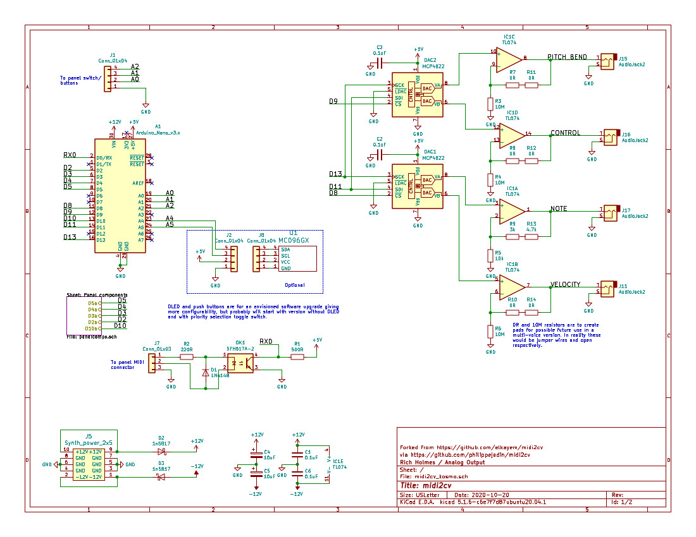
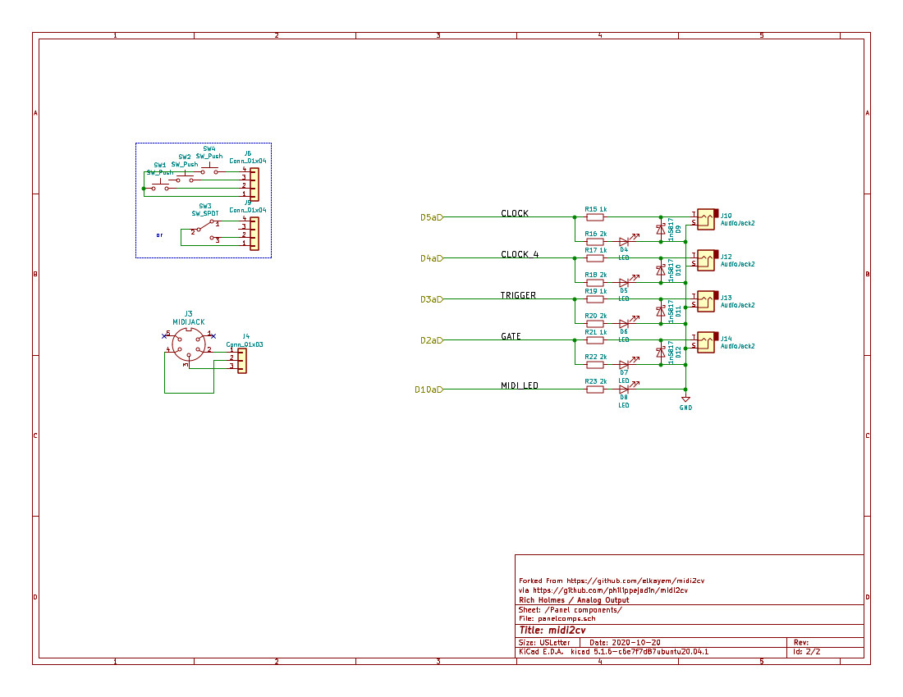

# midi2cv

This project is adapted from https://github.com/elkayem/midi2cv via https://github.com/philippejadin/midi2cv . 

To date the changes have been:

* Converted the schematic to a KiCad project, revising it to use KiCad symbols 
* Converted to Kosmo (or Eurorack) format by including a 10 pin ±12V power connector
* Some component changes, notably a TL074 with split supply in place of the single supply LM324N, and optoisolator changed to H11L1.
* Added blinky LEDs on gate, trigger, clock, and one to be blinked when there is MIDI activity.
* Added push button and bicolor LED for tuning.
* Added CLOCK/4 output; CLOCK will become 4 per quarter note.
* Buffered digital outputs.
* PCB layout for Kosmo format.
* Option to use either hard or soft serial.

Possible further changes — maybe save all these for a future enhanced version:

* Make pitch output range offset variable in hardware or software. That is, allow MIDI 60 to give 0, 1, 2, 3, or 4 volts.
* Make all CV outputs the same range, with feedback capacitor, similar to Befaco MIDI Thing; 300R output resistor in-loop.
* Convert from Arduino Nano to Teensy 4.0 in anticipation of USB MIDI capable version.
* Use MCP4922 instead of MCP4822, with 5V reference
* Replace controls with e.g. 2 push buttons and an OLED display, for more general configuration changes, possibly including reassignment of all output jacks (e.g. 4 channels note and velocity).

### A few more words about output voltage range

As discussed at [https://learningmodular.com/matching-octaves-in-your-modular/](https://learningmodular.com/matching-octaves-in-your-modular/), different MIDI/CV converters in their default configuration give different outputs for MIDI note 60, and different synth oscillators with controls "centered" expect different voltages to produce middle C. It's a mess. 

Oscillator voltages for middle C vary from 0 V to 4 V. Therefore the piano keyboard range (A0 to C8) can be as low as -3.25 V to +4.0 V or as high as +0.75 V to +8.0 V. In McGovern's design the 0 V to +4.096 V range of the MCP4822 gets mapped in hardware to an output range 0 V to +7.25 V, with MIDI 60 corresponding (I think) to +4.25 V. An adjustable offset of -0.25 V to -4.25 V could be done in hardware. Alternatively, though with some loss of pitch resolution, the MCP4822 range could be mapped in hardware to e.g. -3.25 V to +8.0 V and the code could take care of the variable offset. (As is, 1 bit corresponds to 7.25 V / 4096 * 1200 = 2.12 cents. With the wider output range it would be (8-(-3.25))/4096 * 1200 = 3.3 cents. As is, the output stage gain is 7.25 octaves / 4.096 V = 1.77. For the wider range the gain would be 11.25 octaves / 4.096 V = 2.747, achievable using 10k and 7.5k for R3 and R8.)

Either way, to offset the voltage we would need a voltage reference, and if there's a voltage reference maybe we might as well have it be 5 V and use an MCP4922?

**This is very much a work in progress; assume nothing has been tested and nothing works!**

Following is quoted from the project from which this is forked:

This repository contains the code and schematic for a DIY MIDI to CV converter.  I installed this converter into a home-built analog synthesizer, allowing me to play the synthesizer with my Yamaha CP50 keyboard over MIDI.

The MIDI to CV converter includes the following outputs:

* Note CV output (88 keys, 1V/octave) using a 12-bit DAC
* Note priority (highest note, lowest note, or last note) selectable with jumper or 3-way switch
* Pitch bend CV output (0.5 +/-0.5V)
* Velocity CV output (0 to 4V)
* Control Change CV outout (0 to 4V)
* Trigger output (5V, 20 msec pulse for each new key played)
* Gate output (5V when any key depressed)
* Clock output (1 clock per quarter note, 20 msec 5V pulses)

## Parts
* Arduino Nano
* Optocoupler (I used a Vishay SFH618A, but there are plenty of alternatives out there)
* 2x MCP4822 12-bit DACs
* LM324N Quad Op Amp 
* Diode (e.g., 1N917)
* 220, 500, 3x1K, 7.7K (3K+4.7K), 10K Ohm resistors
* 3x 0.1 uF ceramic capacitors
* 5 pin MIDI jack
* 7x 4mm banana plug jacks
* 3-pin header and jumper *or* 3-way switch

The Arduino code uses the standard MIDI and SPI libraries, which can be found in the Arduino Library Manager. 

The schematic is illustrated at the bottom of this page (Eagle file included).  Input power (VIN) is 9-12V.  This is required for the Note CV op amp, used for the 0-7.3V note output.  1% metal film resistors are recommended for the 7.7K and 10K resistors, for a constant op-amp gain that does not change with temperature.  Note that 7.7K is not a standard resistor value.  I used a 3K and a 4.7K resistor in series, which are much more common values.  If precise tuning is desired, a trim pot can be added *or* the constant NOTE_SF can be adjusted in the code.  I opted for the latter.

Note priority is selected using a jumper attached to the three-pin header labelled NP_SEL in the schematic.  This header connects to the Arduino pins A0 and A2, with the center pin attached to ground.  Alternatively, a 3-way switch can be attached to this header. 

The note priority options and jumper configuration are as follows:

* **Highest Note:** When multiple notes are sounded simultaneously, the highest note being held will be sounded.  When the highest note is released, the next highest note will be played, and so on.  Remove the NP_SEL jumper to select this configuration.
* **Lowest Note:** Analagous to highest note, except the lowest note being held will be sounded. Connect the NP_SEL jumper to the A0 pin and center pin (ground) to select this configuration. 
* **Last Note:** The most recent note played will be sounded.  When that note is released, the next most recent note still being held will be sounded.  Connect the NP_SEL jumper to the A2 pin and center pin (ground) to select this configuration.  The illustration below shows the jumper configuration for the Last Note setting.

